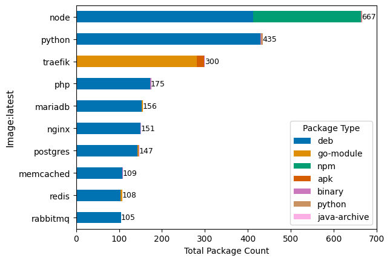
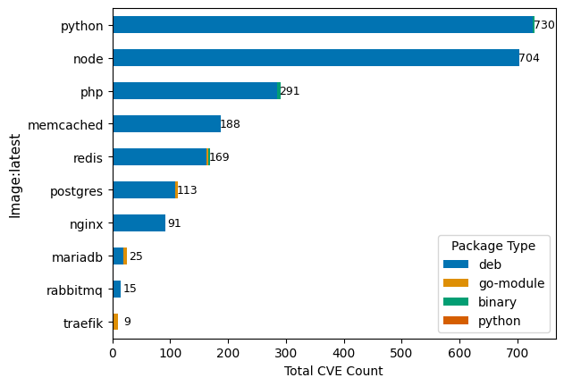
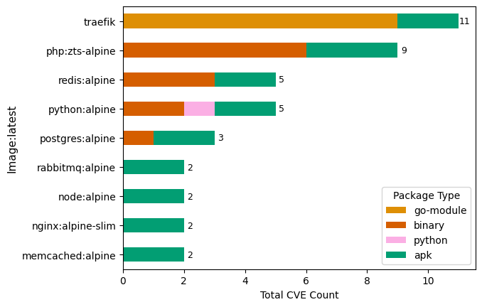
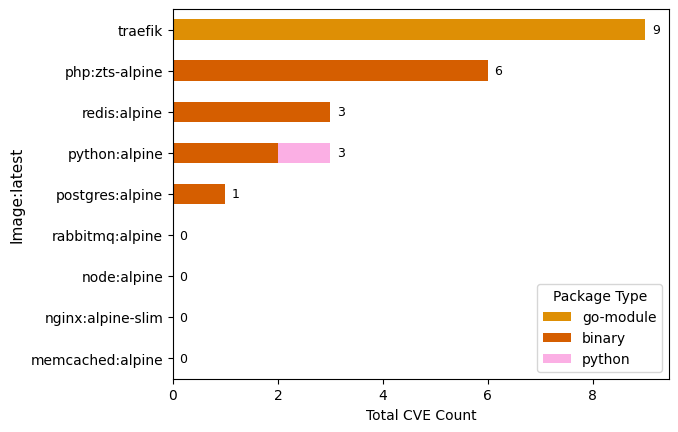

### Why not use popular Docker hub images, update all the OS packages, and call it a day?

Tl:Dr; 
The latest Docker images have a lot of vulnerabilities! Majority of these come from Debian based packages, so trying. 

Let's go for it. 


First, let's get some target images. 
Ten popular images on Docker Hub and their equivalent Chainguard Images will work:

Image     | Docker                                                 | Chainguard                                                                                                                           | 
--------- | ------------------------------------------------------ | ---------------------------------------------------------------------------------------------------------------------------- | 
nginx     | [nginx:latest](https://hub.docker.com/_/nginx)         | [cgr.dev/chainguard/nginx:latest](https://edu.chainguard.dev/chainguard/chainguard-images/reference/nginx/overview/)         | 
python    | [python:latest](https://hub.docker.com/_/python)       | [cgr.dev/chainguard/python:latest](https://edu.chainguard.dev/chainguard/chainguard-images/reference/python/overview/)       | 
redis     | [redis:latest](https://hub.docker.com/_/redis)         | [cgr.dev/chainguard/redis:latest](https://edu.chainguard.dev/chainguard/chainguard-images/reference/redis/overview/)         | 
postgres  | [postgres:latest](https://hub.docker.com/_/postgres)   | [cgr.dev/chainguard/postgres:latest](https://edu.chainguard.dev/chainguard/chainguard-images/reference/postgres/overview/)   | 
node      | [node:latest](https://hub.docker.com/_/node)           | [cgr.dev/chainguard/node:latest](https://edu.chainguard.dev/chainguard/chainguard-images/reference/node/overview/)           | 
memcached | [memcached:latest](https://hub.docker.com/_/memcached) | [cgr.dev/chainguard/memcached:latest](https://edu.chainguard.dev/chainguard/chainguard-images/reference/memcached/overview/) | 
traefik   | [traefik:latest](https://hub.docker.com/_/traefik)     | [cgr.dev/chainguard/traefik:latest](https://edu.chainguard.dev/chainguard/chainguard-images/reference/traefik/overview/)     | 
mariadb   | [mariadb:latest](https://hub.docker.com/_/mariadb)     | [cgr.dev/chainguard/mariadb:latest](https://edu.chainguard.dev/chainguard/chainguard-images/reference/mariadb/overview/)     | 
rabbitmq  | [rabbitmq:latest](https://hub.docker.com/_/rabbitmq)   | [cgr.dev/chainguard/rabbitmq:latest](https://edu.chainguard.dev/chainguard/chainguard-images/reference/rabbitmq/overview/)   | 
php       | [php:latest](https://hub.docker.com/_/php)             | [cgr.dev/chainguard/php:latest](https://edu.chainguard.dev/chainguard/chainguard-images/reference/php/overview/)             |

The goal is to update OS packages within these images.
But what are OS packages?
Let's see what type of packages appear in a container image. 
To do this we can use Syft: an SBOM generator for containers.



That's a lot of packages! The average package count is 235, with 667 packages appearing in node:latest and the smallest package count of 105 in rabbitmq:latest. 
Majority of the packages are Debian based packages, primarily because the what the ```latest``` tag from Docker points at. 
It is possible to use a different base, such as Alpine and we'll get into that later. 

For now, we'll focus on reducing vulnerability counts from the latest Docker images.
So let's see where the vulenrabilities are actually occuring using Grype:



Great! The vulnerabilities are primarily in Debian packages! We should just be able to run ```apt update && apt upgrade``` to pull the latest packages and magically eliminate any old vulnerabilities. For scientific rigour, here's the methods figure:


And for the results...


Well, that didn't help much. So why didn't that help?

It's because the latest stable Debian packages are vulenrable. When running ```apt update && apt upgrade```, it's updating to the latest stable Debian package, which happens to be vulnerable. 

## How to eliminate the bulk of vulnerabilities?

As previously seen, majority of the vulnerabilities appear within Debian based packages.
An alternative to Debian is Alpine.
Generally, Docker images have an Alpine alternative that can be used. 
In the case of this blog, the only image missing the Alpine alternative was mariadb. 

The below analysis follows the same process as using the ```latest``` tag, but uses the tag ```image:alpine```.

 

By switching to the Alpine based image, over XX% of the vulnerabilities were eliminated. 
See this [Hacker News comment thread](https://news.ycombinator.com/item?id=10782897) for more discussion of the issues that might arise and some pro/con comparisons of using Alpine-based images.
Another important point is the fact that Alpine is based on musl, on the other hand, cgr.dev/chainguard/nginx is based on glibc. This blog post: [Why I Will Never Use Alpine Linux Ever Again](https://betterprogramming.pub/why-i-will-never-use-alpine-linux-ever-again-a324fd0cbfd6) highlights some known issues with alpine/musl.

## How can we get rid of the remaining vulnerabilities?

Let's dig into the [Traefik Docker Image](https://hub.docker.com/_/traefik) as an example and those remaining ```go-module``` vulnerabilities. 

[Traefik](https://traefik.io/) is a popular reverse proxy and load balancer software. The [latest traefik official docker image](https://hub.docker.com/_/traefik) averages over 1.6MM pulls per week and has over 1B+ pulls during its lifetime. Safe to say, Traefik is frequently used. So let's dig into some vulnerabilities within the popular docker image. First, we'll pull the latest docker image:

```bash
$ docker pull traefik:latest
latest: Pulling from library/traefik
31e352740f53: Pull complete 
4b9a9b499d7a: Pull complete 
d581263ee7dc: Pull complete 
f5f0f39a1a90: Pull complete 
Digest: sha256:c272e8c32fb7356c2166bc5d170ab0a2c73da7bfec561234c52f255ece1dd07c
Status: Downloaded newer image for traefik:latest
docker.io/library/traefik:latest
```

Let's validate this is the latest stable version of Traefik, 2.10.3 at the time of writing (July 12, 2023):
```bash
$ docker run -u 0 -it traefik:latest traefik version
Version:      2.10.3
Codename:     saintmarcelin
Go version:   go1.20.5
Built:        2023-06-19T16:18:54Z
OS/Arch:      linux/amd64
```

Let's see what vulnerabilities exist within the Traefik image using [Grype](https://github.com/anchore/grype):

```bash
$ grype traefik:latest
 ✔ Vulnerability DB        [no update available]
 ✔ Loaded image            
 ✔ Parsed image            
 ✔ Cataloged packages      [300 packages]
 ✔ Scanning image...       [9 vulnerabilities]
   ├── 0 critical, 3 high, 6 medium, 0 low, 0 negligible
   └── 6 fixed
NAME                            INSTALLED               FIXED-IN      TYPE       VULNERABILITY        SEVERITY 
github.com/docker/distribution  v2.8.1+incompatible     2.8.2-beta.1  go-module  GHSA-hqxw-f8mx-cpmw  High      
github.com/docker/docker        v20.10.21+incompatible  20.10.24      go-module  GHSA-232p-vwff-86mp  High      
github.com/docker/docker        v20.10.21+incompatible  20.10.24      go-module  GHSA-33pg-m6jh-5237  Medium    
github.com/docker/docker        v20.10.21+incompatible  20.10.24      go-module  GHSA-6wrf-mxfj-pf5p  Medium    
github.com/hashicorp/consul     v1.10.12                              go-module  CVE-2021-41803       High      
github.com/hashicorp/consul     v1.10.12                              go-module  CVE-2022-40716       Medium    
github.com/hashicorp/consul     v1.10.12                              go-module  CVE-2023-0845        Medium    
github.com/hashicorp/consul     v1.10.12                1.11.9        go-module  GHSA-m69r-9g56-7mv8  Medium    
github.com/hashicorp/consul     v1.10.12                1.14.5        go-module  GHSA-c57c-7hrj-6q6v  Medium 
```

Nine unique vulnerabilities exist, all coming from go modules. So, how do we update these vulnerable go modules? The first thought would be ```go get example.com/theirmodule@latest```, so let's try it. We can interact with the shell inside of the running container in an attempt to update the go modules:

```bash
$ docker run -u 0 -it traefik:latest /bin/sh
= '/bin/sh' is not a Traefik command: assuming shell execution.
/ # go version
/bin/sh: go: not found
```

The problem is ```go``` is not shipped with the Traefik Docker image. The vulnerability comes from go-modules, and understanding where they are located is key to upgrading them. Let's find out where one of the go modules ``github.com/hashicorp/consul`` is installed using [Syft](https://github.com/anchore/syft):

```bash
$ syft traefik:latest -o json | jq '.artifacts | .[] | select(.name=="github.com/hashicorp/consul")'
 ✔ Loaded image            
 ✔ Parsed image            
 ✔ Cataloged packages      [300 packages]

{
  "id": "1b96b8706474448f",
  "name": "github.com/hashicorp/consul",
  "version": "v1.10.12",
  "type": "go-module",
  "foundBy": "go-module-binary-cataloger",
  "locations": [
    {
      "path": "/usr/local/bin/traefik",
      "layerID": "sha256:b75dbb2e05822bee5bb6f2715169d6202af91e2a83cade5a40fc69bbee0fbbbf",
      "annotations": {
        "evidence": "primary"
      }
    }
  ],
  "licenses": [],
  "language": "go",
  "cpes": [
    "cpe:2.3:a:hashicorp:consul:v1.10.12:*:*:*:*:*:*:*"
  ],
  "purl": "pkg:golang/github.com/hashicorp/consul@v1.10.12",
  "metadataType": "GolangBinMetadata",
  "metadata": {
    "goCompiledVersion": "go1.20.5",
    "architecture": "amd64",
    "h1Digest": "h1:xMazys3KaH5JsZS4Ra6KEAXO0nAj20EsTpsDyhd/3Do=",
    "mainModule": "github.com/traefik/traefik/v2"
  }
}
```

We can see that the path to the location is in ```"path": "/usr/local/bin/traefik"```, which is the binary for traefik. The binary for trafeik is installed in an intermediate layer during the build process of the docker image. Examing the [Dockerfile](https://github.com/traefik/traefik-library-image/blob/v2.10.3/alpine/Dockerfile): 

```Dockerfile
FROM alpine:3.18
RUN apk --no-cache add ca-certificates tzdata
RUN set -ex; \
  apkArch="$(apk --print-arch)"; \
  case "$apkArch" in \
    armhf) arch='armv6' ;; \
    aarch64) arch='arm64' ;; \
    x86_64) arch='amd64' ;; \
    s390x) arch='s390x' ;; \
    *) echo >&2 "error: unsupported architecture: $apkArch"; exit 1 ;; \
  esac; \
  wget --quiet -O /tmp/traefik.tar.gz "https://github.com/traefik/traefik/releases/download/v2.10.3/traefik_v2.10.3_linux_$arch.tar.gz"; \
  tar xzvf /tmp/traefik.tar.gz -C /usr/local/bin traefik; \
  rm -f /tmp/traefik.tar.gz; \
  chmod +x /usr/local/bin/traefik
COPY entrypoint.sh /
EXPOSE 80
ENTRYPOINT ["/entrypoint.sh"]
CMD ["traefik"]
```

Depending on the architecture, it constructs a URL to download the Traefik binary for that architecture from the official Traefik GitHub repository.
It uses wget to download the Traefik binary tarball and saves it to /tmp/traefik.tar.gz.
The tarball is then extracted to /usr/local/bin using tar.
After extraction, the tarball is removed (rm -f).
Finally, the executable permission is set on the Traefik binary using chmod.

So the vulnerability comes from the upstream Traefik binary, bringing up the old-aged problem of dependency lag. 
Updating the consul package requires rebuilding the Traefik binary with the updated non-vulnerable vulnerable version of consul.
Within the [go.mod](https://github.com/traefik/traefik/blob/v2.10.3/go.mod) file of Traefik we can see consul is pinned at the [vulnerable version of 1.10.12](https://github.com/traefik/traefik/blob/v2.10.3/go.mod#L29), even though the patch is in the available version of consul [1.15.3](https://github.com/hashicorp/consul/releases). 

Thankfully, Chainguard has done the heavy lifting of updating vulnerable versions of dependencies.
We can see Chainguard has updated the consul package to the non-vulnerable version of 1.15.3 within the latest [cgr.dev/chainguard/traefik](https://edu.chainguard.dev/chainguard/chainguard-images/reference/traefik/overview/) image:
```bash
$ syft cgr.dev/chainguard/traefik:latest -o json | jq '.artifacts | .[] | select(.name=="github.com/hashicorp/consul")'
 ✔ Loaded image            
 ✔ Parsed image            
 ✔ Cataloged packages      [291 packages]
{
  "id": "7adfeebf788f965c",
  "name": "github.com/hashicorp/consul",
  "version": "v1.15.3",
  "type": "go-module",
  "foundBy": "go-module-binary-cataloger",
  "locations": [
    {
      "path": "/usr/bin/traefik",
      "layerID": "sha256:eea78a04e2cbe0cff6c52418a0ec87dc21f9872259e96e4991f03244c4f77350",
      "annotations": {
        "evidence": "primary"
      }
    }
  ],
  "licenses": [],
  "language": "go",
  "cpes": [
    "cpe:2.3:a:hashicorp:consul:v1.15.3:*:*:*:*:*:*:*"
  ],
  "purl": "pkg:golang/github.com/hashicorp/consul@v1.15.3",
  "metadataType": "GolangBinMetadata",
  "metadata": {
    "goCompiledVersion": "go1.20.5",
    "architecture": "amd64",
    "h1Digest": "h1:ErNocU3HT14vdAdBpO/42pjkEpSkZYwuHzTzvrlmr0c=",
    "mainModule": "github.com/traefik/traefik/v2"
  }
}
```


## How to eliminate all of the vulenrabilities?

Chainguard. 